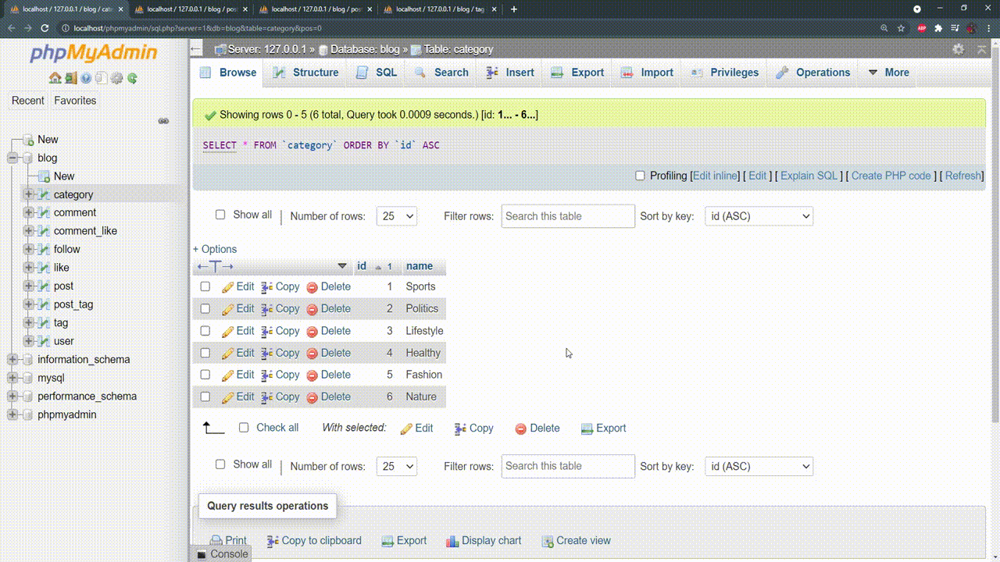

### Fetch Recent Posts

Top-Level Directory Structure :deciduous_tree:

```txt
\---blog
    +---assets
    +---home
    |       index.php
    +---layout
    +---utils
    |       database.config.php
    |       database.connection.php 
    |---vendor
```

```/home```: Homepage of Sprints blog with the functionality of fetching recent posts.

```/utils```: MySQL database configuration and connection.


> I needed to populate some dummy data in the database to make sure data are displayed properly.

 


